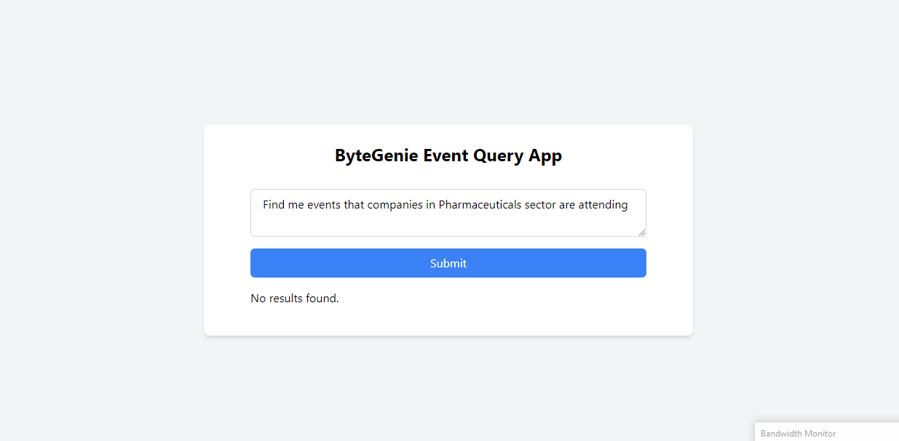
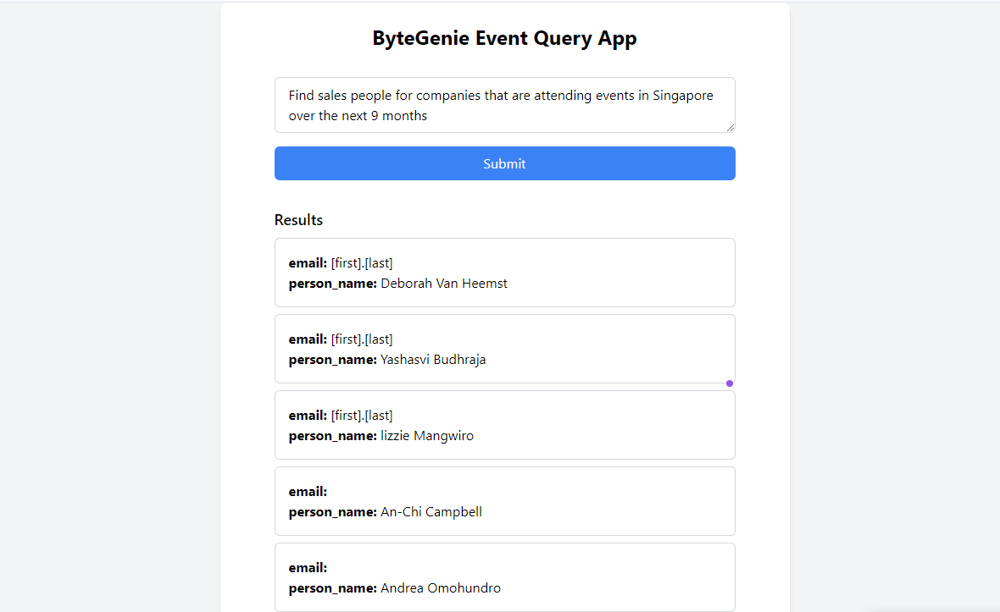

# ByteGenie FullStack Developer Test

## Overview

This project is an AI-powered application that allows users to interact with events, companies, and people data using natural language queries.

## Structure

- `api/`: Contains the Flask API to process queries and interact with the database.
- `frontend/`: Contains the React application to provide a user interface for querying data.
- `database/`: Contains the SQL schema and documentation for the database.

## Setup

### API

1. Navigate to the `api/` directory.
2. Install dependencies:
    ```sh
    pip install -r requirements.txt
    ```
3. Run the Flask API:
    ```sh
    python load_data.py
    python app.py
    ```

### Frontend

1. Navigate to the `frontend/` directory.
2. Install dependencies:
    ```sh
    npm install
    ```
3. Start the React app:
    ```sh
    npm start
    ```


## Key Features

- **Natural Language Processing**: Uses a pre-trained model to parse user queries.
- **Dynamic SQL Query Generation**: Constructs SQL queries based on parsed information.
- **Data Integration**: Merges events, companies, and people data for comprehensive querying.

## Challenges

- Parsing complex user queries accurately.
- Ensuring data consistency and integrity.
- Optimizing query performance.

## Improvements

- Enhance NLP model for better query parsing.
- Implement more robust error handling and validations.
- Optimize database schema and indexing for faster queries.

## Contact


